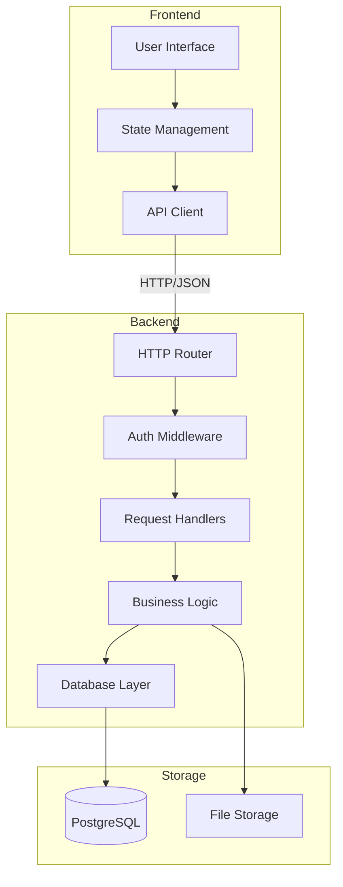

# Design Document: Interactive Fanfic Platform

## Overview

A plataforma de fanfics interativas é uma aplicação web full-stack que permite aos usuários publicar e ler histórias de fãs com um recurso único de personalização através de perguntas interativas. O sistema consiste em um backend RESTful implementado em Go e um frontend moderno com design responsivo.

A arquitetura segue o padrão cliente-servidor, onde o backend gerencia toda a lógica de negócio, autenticação, e persistência de dados, enquanto o frontend fornece uma interface rica e interativa para os usuários.

## Architecture

### High-Level Architecture



### Technology Stack

**Backend:**
- Language: Go 1.21+
- Web Framework: Gin or Chi
- Database: PostgreSQL
- ORM: GORM or sqlx
- Authentication: JWT tokens
- File Storage: Local filesystem or S3-compatible storage

**Frontend:**
- HTML5, CSS3, JavaScript (ES6+)
- Framework: React or Vue.js (for state management and reactivity)
- Styling: CSS Modules or Tailwind CSS
- HTTP Client: Fetch API or Axios

## Components and Interfaces

### Backend Components

#### 1. Authentication Service

Manages user registration, login, and session management.

```go
type AuthService interface {
    Register(username, email, password string) (*User, error)
    Login(email, password string) (token string, error)
    ValidateToken(token string) (*User, error)
    Logout(token string) error
}
```

#### 2. Fanfic Service

Handles all fanfic-related operations including creation, updates, and retrieval.

```go
type FanficService interface {
    CreateFanfic(authorID int, title, synopsis, disclaimer, category string, cover []byte) (*Fanfic, error)
    UpdateFanfic(fanficID int, updates FanficUpdate) (*Fanfic, error)
    GetFanfic(fanficID int) (*Fanfic, error)
    ListFanficsByCategory() (map[string][]Fanfic, error)
    DeleteFanfic(fanficID int, authorID int) error
    GetAuthorFanfics(authorID int) ([]Fanfic, error)
}
```

#### 3. Chapter Service

Manages chapter creation, editing, ordering, and retrieval.

```go
type ChapterService interface {
    CreateChapter(fanficID int, title, content string, order int) (*Chapter, error)
    UpdateChapter(chapterID int, title, content string) (*Chapter, error)
    DeleteChapter(chapterID int) error
    ReorderChapters(fanficID int, newOrder []int) error
    GetChapter(chapterID int) (*Chapter, error)
    ListChapters(fanficID int) ([]Chapter, error)
}
```

#### 4. Interactive Mode Service

Handles interactive questions, answer storage, and placeholder substitution.

```go
type InteractiveService interface {
    CreateQuestion(fanficID int, questionText, placeholder string) (*Question, error)
    UpdateQuestion(questionID int, questionText string) (*Question, error)
    DeleteQuestion(questionID int) error
    ListQuestions(fanficID int) ([]Question, error)
    
    SaveAnswers(userID, fanficID int, answers map[string]string) error
    GetAnswers(userID, fanficID int) (map[string]string, error)
    UpdateAnswer(userID, fanficID int, placeholder, answer string) error
    
    SubstitutePlaceholders(content string, answers map[string]string) string
    HasPendingQuestions(userID, fanficID int) (bool, []Question, error)
}
```

#### 5. Comment Service

Manages comments on fanfics and chapters.

```go
type CommentService interface {
    CreateComment(userID, fanficID int, chapterID *int, content string) (*Comment, error)
    DeleteComment(commentID, userID int) error
    ListFanficComments(fanficID int) ([]Comment, error)
    ListChapterComments(chapterID int) ([]Comment, error)
}
```

### Frontend Components

#### 1. Homepage Component

Displays fanfics grouped by category with hover effects.

**Props:** None (fetches data on mount)

**State:**
- `fanficsByCategory`: Object mapping categories to fanfic arrays
- `loading`: Boolean for loading state

**Key Features:**
- Grid layout with fanfic cards
- Hover effect showing synopsis and "read more" button
- Category sections

#### 2. Fanfic Detail Component

Shows complete fanfic information including chapters and interactive mode options.

**Props:**
- `fanficId`: ID of the fanfic to display

**State:**
- `fanfic`: Fanfic object with metadata
- `chapters`: Array of chapter objects
- `hasInteractiveMode`: Boolean
- `userAnswers`: Object with user's answers (if any)

#### 3. Interactive Questions Modal

Presents questions to readers before they start reading.

**Props:**
- `questions`: Array of question objects
- `existingAnswers`: Object with previously saved answers
- `onSubmit`: Callback function

**State:**
- `answers`: Object mapping placeholders to user inputs
- `isValid`: Boolean indicating if all questions are answered

#### 4. Chapter Reader Component

Displays chapter content with placeholder substitution in interactive mode.

**Props:**
- `chapterId`: ID of the chapter
- `interactiveMode`: Boolean
- `answers`: Object with user answers (for substitution)

**State:**
- `chapter`: Chapter object
- `processedContent`: Content with placeholders replaced

#### 5. Author Dashboard Component

Management interface for authors to edit fanfics, chapters, and view comments.

**Props:**
- `authorId`: ID of the logged-in author

**State:**
- `fanfics`: Array of author's fanfics
- `selectedFanfic`: Currently selected fanfic for editing
- `comments`: Comments for selected fanfic

## Data Models

### User

```go
type User struct {
    ID           int       `json:"id"`
    Username     string    `json:"username"`
    Email        string    `json:"email"`
    PasswordHash string    `json:"-"`
    CreatedAt    time.Time `json:"created_at"`
    UpdatedAt    time.Time `json:"updated_at"`
}
```

### Fanfic

```go
type Fanfic struct {
    ID              int       `json:"id"`
    AuthorID        int       `json:"author_id"`
    Title           string    `json:"title"`
    Synopsis        string    `json:"synopsis"`
    Disclaimer      string    `json:"disclaimer"`
    Category        string    `json:"category"`
    CoverURL        string    `json:"cover_url"`
    InteractiveMode bool      `json:"interactive_mode"`
    CreatedAt       time.Time `json:"created_at"`
    UpdatedAt       time.Time `json:"updated_at"`
}
```

### Chapter

```go
type Chapter struct {
    ID        int       `json:"id"`
    FanficID  int       `json:"fanfic_id"`
    Title     string    `json:"title"`
    Content   string    `json:"content"`
    Order     int       `json:"order"`
    CreatedAt time.Time `json:"created_at"`
    UpdatedAt time.Time `json:"updated_at"`
}
```

### Question

```go
type Question struct {
    ID           int       `json:"id"`
    FanficID     int       `json:"fanfic_id"`
    QuestionText string    `json:"question_text"`
    Placeholder  string    `json:"placeholder"`
    CreatedAt    time.Time `json:"created_at"`
}
```

### Answer

```go
type Answer struct {
    ID          int       `json:"id"`
    UserID      int       `json:"user_id"`
    FanficID    int       `json:"fanfic_id"`
    Placeholder string    `json:"placeholder"`
    AnswerText  string    `json:"answer_text"`
    CreatedAt   time.Time `json:"created_at"`
    UpdatedAt   time.Time `json:"updated_at"`
}
```

### Comment

```go
type Comment struct {
    ID        int       `json:"id"`
    UserID    int       `json:"user_id"`
    FanficID  int       `json:"fanfic_id"`
    ChapterID *int      `json:"chapter_id,omitempty"`
    Content   string    `json:"content"`
    CreatedAt time.Time `json:"created_at"`
}
```

### PendingQuestion

```go
type PendingQuestion struct {
    ID         int       `json:"id"`
    UserID     int       `json:"user_id"`
    FanficID   int       `json:"fanfic_id"`
    QuestionID int       `json:"question_id"`
    CreatedAt  time.Time `json:"created_at"`
}
```

## API Endpoints

### Authentication

- `POST /api/auth/register` - Register new user
- `POST /api/auth/login` - Login and receive JWT token
- `POST /api/auth/logout` - Logout and invalidate token

### Fanfics

- `GET /api/fanfics` - List all fanfics grouped by category
- `GET /api/fanfics/:id` - Get fanfic details
- `POST /api/fanfics` - Create new fanfic (authenticated)
- `PUT /api/fanfics/:id` - Update fanfic (authenticated, author only)
- `DELETE /api/fanfics/:id` - Delete fanfic (authenticated, author only)
- `GET /api/users/:id/fanfics` - Get all fanfics by author

### Chapters

- `GET /api/fanfics/:id/chapters` - List all chapters for a fanfic
- `GET /api/chapters/:id` - Get specific chapter
- `POST /api/fanfics/:id/chapters` - Create new chapter (authenticated, author only)
- `PUT /api/chapters/:id` - Update chapter (authenticated, author only)
- `DELETE /api/chapters/:id` - Delete chapter (authenticated, author only)
- `PUT /api/fanfics/:id/chapters/reorder` - Reorder chapters (authenticated, author only)

### Interactive Mode

- `GET /api/fanfics/:id/questions` - List all questions for a fanfic
- `POST /api/fanfics/:id/questions` - Create question (authenticated, author only)
- `PUT /api/questions/:id` - Update question (authenticated, author only)
- `DELETE /api/questions/:id` - Delete question (authenticated, author only)
- `GET /api/fanfics/:id/answers` - Get user's answers for a fanfic (authenticated)
- `POST /api/fanfics/:id/answers` - Save answers (authenticated)
- `PUT /api/fanfics/:id/answers` - Update answers (authenticated)
- `GET /api/fanfics/:id/pending-questions` - Check for pending questions (authenticated)

### Comments

- `GET /api/fanfics/:id/comments` - Get all comments for a fanfic
- `GET /api/chapters/:id/comments` - Get all comments for a chapter
- `POST /api/fanfics/:id/comments` - Create comment on fanfic (authenticated)
- `POST /api/chapters/:id/comments` - Create comment on chapter (authenticated)
- `DELETE /api/comments/:id` - Delete comment (authenticated, author or comment owner)

## UI Design Specifications

### Color Palette

The design uses a combination of pastel and intense tones:

**Primary Color (Purple):**
- Pastel: `#E6D5F5` (backgrounds, cards)
- Medium: `#B794F6` (hover states, accents)
- Intense: `#7C3AED` (buttons, links, active states)

**Secondary Color (Pink):**
- Pastel: `#FDE2E4` (highlights, badges)
- Medium: `#FBB6CE` (secondary buttons)
- Intense: `#EC4899` (important actions)

**Accent Color (Blue):**
- Pastel: `#DBEAFE` (info boxes)
- Medium: `#93C5FD` (borders)
- Intense: `#3B82F6` (interactive elements)

**Neutral:**
- White: `#FFFFFF`
- Light Gray: `#F3F4F6`
- Medium Gray: `#9CA3AF`
- Dark Gray: `#374151`

### Typography

- Headings: Modern sans-serif (e.g., Inter, Poppins)
- Body: Readable sans-serif (e.g., Inter, System UI)
- Chapter Content: Serif font for better readability (e.g., Merriweather, Georgia)

### Layout Patterns

**Homepage:**
- Header with logo and user menu
- Category sections with horizontal scrolling or grid
- Fanfic cards with cover image (aspect ratio 2:3)
- Hover overlay with synopsis and button

**Fanfic Detail Page:**
- Hero section with large cover, title, synopsis, disclaimer
- Chapter list with numbered items
- Interactive mode toggle (if available)
- Comments section below

**Chapter Reader:**
- Clean, distraction-free reading experience
- Navigation between chapters
- Progress indicator

**Author Dashboard:**
- Sidebar with fanfic list
- Main area with tabs: Edit Info, Manage Chapters, Questions, Comments


## Correctness Properties

*A property is a characteristic or behavior that should hold true across all valid executions of a system—essentially, a formal statement about what the system should do. Properties serve as the bridge between human-readable specifications and machine-verifiable correctness guarantees.*

### Authentication Properties

**Property 1: Valid credentials create sessions**
*For any* valid username and password combination, authenticating with those credentials should result in a valid session token being created.
**Validates: Requirements 1.1**

**Property 2: Invalid credentials are rejected**
*For any* invalid credential combination (wrong password, non-existent user, malformed input), authentication should fail and return an appropriate error.
**Validates: Requirements 1.2**

**Property 3: Registration creates unique users**
*For any* valid registration data, creating a new user should result in a unique user ID being assigned, and attempting to register with the same email should fail.
**Validates: Requirements 1.3**

**Property 4: Logout terminates sessions**
*For any* valid session token, logging out should invalidate that token such that subsequent requests using it are rejected.
**Validates: Requirements 1.4**

### Fanfic Publication Properties

**Property 5: Fanfic creation persists all data**
*For any* valid fanfic data (title, synopsis, cover, disclaimer, category), creating a fanfic should result in all fields being stored and retrievable with a unique ID.
**Validates: Requirements 2.1, 2.2, 2.4, 2.6**

**Property 6: Published fanfics appear on homepage**
*For any* published fanfic, it should appear in the homepage listing under its assigned category.
**Validates: Requirements 2.5, 5.1**

**Property 7: Image validation rejects invalid formats**
*For any* uploaded file, if it is not a valid image format or exceeds size limits, the upload should be rejected with an appropriate error.
**Validates: Requirements 2.3**

### Chapter Management Properties

**Property 8: Chapter ordering is maintained**
*For any* fanfic with multiple chapters, the chapters should always be displayed in sequential order regardless of creation order or modifications.
**Validates: Requirements 3.1, 3.4, 6.3**

**Property 9: Chapter updates preserve identity**
*For any* chapter, updating its title or content should preserve the chapter ID and maintain its position in the sequence.
**Validates: Requirements 3.2**

**Property 10: Chapter deletion adjusts ordering**
*For any* fanfic with N chapters, deleting chapter at position K should result in N-1 chapters with sequential ordering from 1 to N-1.
**Validates: Requirements 3.3**

**Property 11: Chapter reordering updates sequence**
*For any* fanfic and any valid permutation of its chapter IDs, applying that reordering should result in chapters being displayed in the new order.
**Validates: Requirements 3.5**

### Interactive Mode Properties

**Property 12: Questions are persisted with placeholders**
*For any* question text and placeholder identifier, creating a question should store both and associate them with the fanfic.
**Validates: Requirements 4.1, 4.2**

**Property 13: New questions create pending status**
*For any* fanfic with existing readers who have answer sets, adding a new question should mark all those readers as having pending questions for that fanfic.
**Validates: Requirements 4.3, 9.1**

**Property 14: Question deletion removes data**
*For any* question, deleting it should remove the question and its placeholder from the system.
**Validates: Requirements 4.4**

**Property 15: Placeholder validation**
*For any* chapter content in interactive mode, all placeholders in the text should have corresponding questions, otherwise validation should fail.
**Validates: Requirements 4.5**

### Display and Rendering Properties

**Property 16: Homepage groups by category**
*For any* set of published fanfics, the homepage should display them grouped by category with all fanfics of the same category together.
**Validates: Requirements 5.1**

**Property 17: Fanfic cards include covers**
*For any* fanfic displayed on the homepage, the rendered card should include the cover image URL.
**Validates: Requirements 5.2**

**Property 18: Category ordering by date**
*For any* category with multiple fanfics, they should be ordered by publication date (newest first) within that category.
**Validates: Requirements 5.4**

**Property 19: Detail page completeness**
*For any* fanfic, the detail page should include the cover, synopsis, and a list of all chapters with titles and numbers.
**Validates: Requirements 6.2, 6.3**

**Property 20: Interactive mode option visibility**
*For any* fanfic with interactive mode enabled, the detail page should display options for both interactive and non-interactive reading modes.
**Validates: Requirements 6.4**

### Interactive Reading Properties

**Property 21: Questions presented before reading**
*For any* fanfic in interactive mode, if a reader has not answered all questions, attempting to read a chapter should present the questions first.
**Validates: Requirements 7.1**

**Property 22: Answers are persisted with associations**
*For any* set of answers submitted by a reader for a fanfic, the answers should be stored with correct user ID and fanfic ID associations and be retrievable.
**Validates: Requirements 7.2, 8.1**

**Property 23: Placeholder substitution in interactive mode**
*For any* chapter content with placeholders and a complete answer set, reading in interactive mode should replace all placeholders with corresponding answers.
**Validates: Requirements 7.3, 8.3**

**Property 24: Pending questions trigger notifications**
*For any* reader with pending questions for a fanfic, attempting to read should display a notification with options to answer questions or switch to non-interactive mode.
**Validates: Requirements 7.4, 9.2, 9.3**

**Property 25: Non-interactive mode shows original text**
*For any* chapter content with placeholders, reading in non-interactive mode should display the original text without any substitution.
**Validates: Requirements 7.5**

**Property 26: Answer updates are immediate**
*For any* existing answer, modifying it should immediately persist the change such that subsequent reads use the updated value.
**Validates: Requirements 8.2**

**Property 27: Answering clears pending status**
*For any* reader with pending questions, submitting answers to all pending questions should clear the pending status for that fanfic.
**Validates: Requirements 9.4**

### Backend API Properties

**Property 28: Input validation rejects invalid data**
*For any* API endpoint, submitting invalid input data should result in a 400 Bad Request response with an error message.
**Validates: Requirements 10.3**

**Property 29: Error responses include status codes**
*For any* error condition, the API should return an appropriate HTTP status code (4xx for client errors, 5xx for server errors) and an error message.
**Validates: Requirements 10.4**

**Property 30: Protected endpoints require authentication**
*For any* protected endpoint, attempting to access it without a valid authentication token should result in a 401 Unauthorized response.
**Validates: Requirements 10.5**

### Data Persistence Properties

**Property 31: Data modifications are durable**
*For any* entity (user, fanfic, chapter, question, answer, comment), creating or updating it should persist the changes such that subsequent queries return the updated data.
**Validates: Requirements 12.1, 12.2**

**Property 32: Transactions maintain consistency**
*For any* operation that modifies multiple related entities, either all changes should be persisted or none should be, maintaining referential integrity.
**Validates: Requirements 12.4**

### Comment System Properties

**Property 33: Comments are stored with metadata**
*For any* comment submitted by a user, it should be stored with the user ID, fanfic ID, optional chapter ID, timestamp, and content.
**Validates: Requirements 13.1, 13.2**

**Property 34: Comments are ordered chronologically**
*For any* fanfic or chapter with multiple comments, they should be displayed in chronological order (oldest first or newest first, consistently).
**Validates: Requirements 13.3**

**Property 35: Comment deletion removes from display**
*For any* comment, deleting it should remove it from all subsequent queries and displays.
**Validates: Requirements 13.4**

**Property 36: All comments are displayed**
*For any* fanfic, viewing it should display all comments associated with it and its chapters.
**Validates: Requirements 13.5**

**Property 37: Comment deletion authorization**
*For any* comment, deletion should succeed if and only if the requesting user is either the comment author or the fanfic owner.
**Validates: Requirements 13.6**

### Dashboard Properties

**Property 38: Authors see only their fanfics**
*For any* author, accessing their dashboard should display all and only the fanfics they created.
**Validates: Requirements 14.1**

**Property 39: Dashboard options are complete**
*For any* selected fanfic in the dashboard, the interface should provide options to edit metadata, add chapters, manage questions, and view comments.
**Validates: Requirements 14.2**

**Property 40: Metadata updates are persisted**
*For any* fanfic metadata field (title, synopsis, cover, disclaimer, category), updating it through the dashboard should persist the change.
**Validates: Requirements 14.3, 14.5**

**Property 41: Comments are grouped by chapter**
*For any* fanfic with comments on multiple chapters, the dashboard should display comments grouped by their associated chapter.
**Validates: Requirements 14.4**


## Error Handling

### Backend Error Handling

**HTTP Status Codes:**
- `200 OK` - Successful GET requests
- `201 Created` - Successful POST requests creating resources
- `204 No Content` - Successful DELETE requests
- `400 Bad Request` - Invalid input data, validation failures
- `401 Unauthorized` - Missing or invalid authentication token
- `403 Forbidden` - Valid authentication but insufficient permissions
- `404 Not Found` - Requested resource does not exist
- `409 Conflict` - Resource conflict (e.g., duplicate email)
- `500 Internal Server Error` - Unexpected server errors

**Error Response Format:**
```json
{
  "error": {
    "code": "VALIDATION_ERROR",
    "message": "Invalid input data",
    "details": [
      {
        "field": "email",
        "message": "Email format is invalid"
      }
    ]
  }
}
```

**Error Categories:**

1. **Validation Errors:**
   - Invalid email format
   - Password too short
   - Missing required fields
   - Invalid image format/size
   - Invalid placeholder format

2. **Authentication Errors:**
   - Invalid credentials
   - Expired token
   - Missing token
   - Token verification failure

3. **Authorization Errors:**
   - User not owner of resource
   - Insufficient permissions
   - Cannot delete others' comments (unless fanfic owner)

4. **Resource Errors:**
   - Fanfic not found
   - Chapter not found
   - User not found
   - Question not found

5. **Business Logic Errors:**
   - Cannot enable interactive mode without questions
   - Cannot read in interactive mode without answering questions
   - Placeholder in content has no corresponding question
   - Cannot reorder chapters with invalid sequence

### Frontend Error Handling

**User-Facing Error Messages:**
- Display errors in a non-intrusive toast/notification
- Form validation errors shown inline near the field
- Critical errors shown in modal dialogs
- Network errors with retry options

**Error Recovery:**
- Automatic retry for transient network errors (with exponential backoff)
- Form data preservation on validation errors
- Graceful degradation when features are unavailable
- Clear call-to-action for user-correctable errors

**Loading States:**
- Skeleton screens for initial page loads
- Spinners for button actions
- Progress indicators for file uploads
- Disabled state for forms during submission

## Testing Strategy

### Overview

The testing strategy employs a dual approach combining unit tests for specific examples and edge cases with property-based tests for universal correctness properties. This ensures both concrete functionality and general correctness across all possible inputs.

### Property-Based Testing

**Framework:** We will use a property-based testing library appropriate for Go:
- **Backend:** Use `gopter` (Go property testing library) or `rapid` for property-based testing in Go

**Configuration:**
- Each property test must run a minimum of 100 iterations
- Tests should generate random valid inputs within the domain
- Each test must reference its corresponding design property

**Test Tagging Format:**
```go
// Feature: interactive-fanfic-platform, Property 1: Valid credentials create sessions
func TestProperty_ValidCredentialsCreateSessions(t *testing.T) {
    // Property test implementation
}
```

**Property Test Coverage:**

The following correctness properties will be implemented as property-based tests:

1. **Authentication Properties (1-4):** Test with randomly generated usernames, passwords, and tokens
2. **Fanfic Publication Properties (5-7):** Test with random fanfic data, categories, and image files
3. **Chapter Management Properties (8-11):** Test with random chapter sequences and reorderings
4. **Interactive Mode Properties (12-15):** Test with random questions, placeholders, and answer sets
5. **Display Properties (16-20):** Test with random fanfic collections and categories
6. **Interactive Reading Properties (21-27):** Test with random content, placeholders, and answers
7. **Backend API Properties (28-30):** Test with random valid and invalid inputs
8. **Data Persistence Properties (31-32):** Test with random entity data and concurrent modifications
9. **Comment System Properties (33-37):** Test with random comments and user permissions
10. **Dashboard Properties (38-41):** Test with random author/fanfic combinations

**Generator Strategies:**

- **User Generator:** Random usernames, emails, passwords (valid and invalid)
- **Fanfic Generator:** Random titles, synopses, disclaimers, categories
- **Chapter Generator:** Random titles, content, orderings
- **Question Generator:** Random question text, placeholder identifiers
- **Answer Generator:** Random answer text matching placeholders
- **Comment Generator:** Random comment content, timestamps
- **Image Generator:** Valid and invalid image data (formats, sizes)

### Unit Testing

**Framework:** Standard Go testing package with table-driven tests

**Unit Test Focus:**

1. **Specific Examples:**
   - User registration with valid data
   - Fanfic creation with all fields
   - Chapter ordering after specific deletions
   - Placeholder substitution with known values

2. **Edge Cases:**
   - Empty input strings
   - Very long content (stress testing)
   - Special characters in text
   - Boundary values (e.g., maximum image size)
   - Concurrent access to same resource

3. **Error Conditions:**
   - Duplicate email registration
   - Invalid image formats
   - Missing required fields
   - Unauthorized access attempts
   - Database connection failures

4. **Integration Points:**
   - Database transactions
   - File upload handling
   - JWT token generation and validation
   - Password hashing and verification

**Test Organization:**
```
backend/
├── auth/
│   ├── service.go
│   ├── service_test.go          # Unit tests
│   └── service_property_test.go # Property tests
├── fanfic/
│   ├── service.go
│   ├── service_test.go
│   └── service_property_test.go
└── ...
```

### Frontend Testing

**Framework:** Jest or Vitest for unit tests, React Testing Library for component tests

**Test Coverage:**

1. **Component Tests:**
   - Homepage renders fanfics by category
   - Fanfic card displays cover and synopsis on hover
   - Interactive questions modal validates all answers
   - Chapter reader substitutes placeholders correctly

2. **Integration Tests:**
   - Complete user registration and login flow
   - Fanfic creation and publication workflow
   - Interactive reading experience end-to-end
   - Comment submission and display

3. **API Client Tests:**
   - Mock API responses
   - Error handling and retry logic
   - Token management

### Test Execution

**Continuous Integration:**
- Run all tests on every commit
- Property tests run with 100 iterations in CI
- Frontend and backend tests run in parallel
- Code coverage reports generated

**Local Development:**
- Fast unit tests run on file save
- Full test suite before commits
- Property tests can run with fewer iterations locally (e.g., 20) for speed

### Test Data Management

**Database:**
- Use in-memory database (SQLite) for tests
- Reset database between tests
- Seed with minimal required data

**File Storage:**
- Use temporary directories for test uploads
- Clean up after each test
- Mock external storage services

**Test Isolation:**
- Each test should be independent
- No shared state between tests
- Use transactions that rollback for database tests

